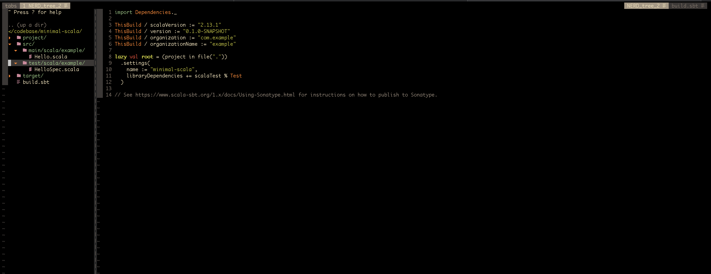

<h1 align="center"> ✨ Dot file  ✨ </h1>

  

- clone directly into ~/.vim directory
- This repo contains my vim configuration files, currently supported languages are *** Scala, Go, Rust *** .
- Also contains other configurations 
